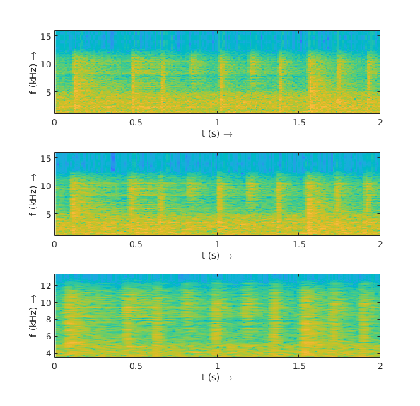
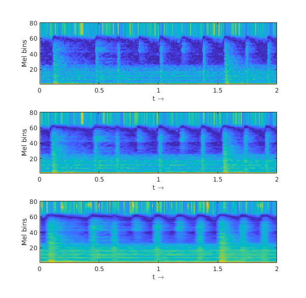
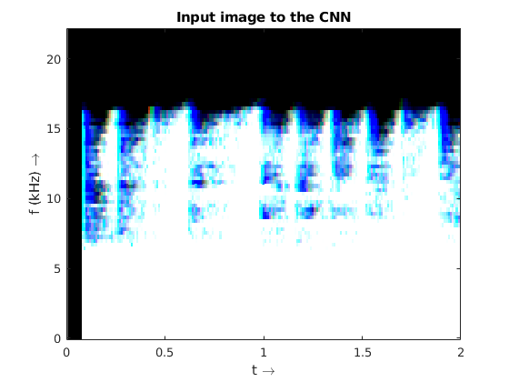
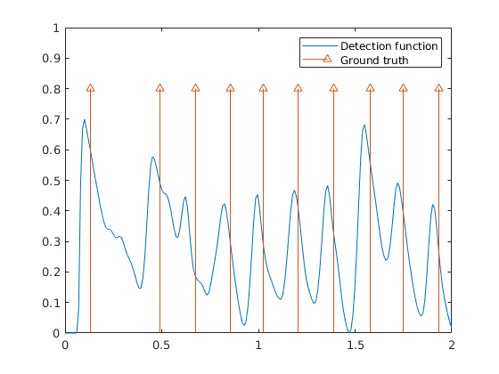

# nA Custom CNN for Onset Detection
This repository contains a MATLAB example for Onset Detection using a Convolutional Neural Network (CNN). The repository contains a matconvnet distribution for training/evaluation.

### Training and Testing Databases
For use, please download the training and testing databases and install them in a folder in your local PC.
* Training: Leveau Onset Database (available [here](http://www.tsi.telecom-paristech.fr/aao/en/2011/07/13/onset_leveau-a-database-for-onset-detection/))
* Testing: Prosemus Onset Database (available [here](http://first.hansanet.ee/~istchoruso/wiki/index.php/Onset_Detection_Database))

## Evaluation
For evaluating, several learned models are included in the ```learned_models``` folder. To have a look, run ```onset_test.m```

### Input spectrograms ###
The spectrograms of the audio files are first extracted at different time resolutions.

||
|:--:|
| <sub> *Input spectrograms. From top to bottom: with 23ms, 46ms and 93ms time resolution.* </sub>|


### Dimensionality reduction ###
The spectrograms are then filtered using a mel-spaced frequency filter bank of 80 filters, so to reduce redundancy at the time of learning.

||
|:--:|
| <sub> *Mel-filtered Spectrum.*  </sub>|


This gives an input for the CNN which is comprised of three channels, each of which describes a different temporal resolution, but describing the same frequency components. A possible depiction would contain the same number of frequency bands, but smeared in the time domain. This effect is represented in the next picture, which shows an RGB representation of such an input.

||
|:--:|
| <sub> *An RGB representation of the input for the network.* </sub>|

However, the CNN will look for the relationships and differences in the input space, finding relationships in both time and frequency.

### Trained model
The model that is used in the example is a 10-layer convolutional network with different filter sizes and a rectifying units attached at the end of each convolutional layer. The label which was applied for training is an _onset detection function_.

The output of the CNN is then post-processed to deliver a generated onset detection function, which is shown below.

||
|:--:|
| <sub> *Generated onset detection function and its ground truth.* </sub>|

The output shows a correct identification of the onsets which play along with the audio file.


### Training
A training script is included in ```onset_train.m```. Optionally, there is the option to use the mel-filtered spectral flux, which exploits the relationships between subsequent time bins in the spectrogram.

### References
This implementation is based on:
[1]. Jan Schlüter and Sebastian Böck. "Improved Musical Onset Detection with Convolutional Neural Networks." 2014 IEEE International Conference on Acoustics, Speech and Signal Processing (ICASSP). IEEE, 2014.

For more information on matconvnet visit its [official repository](https://github.com/vlfeat/matconvnet)
